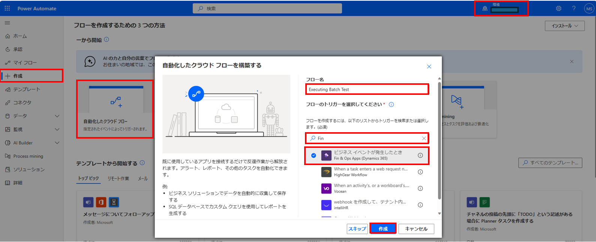
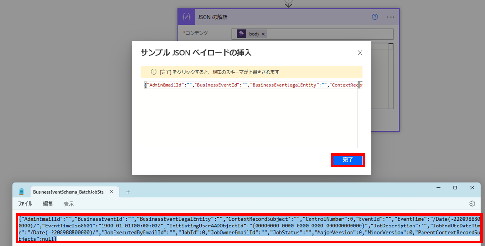
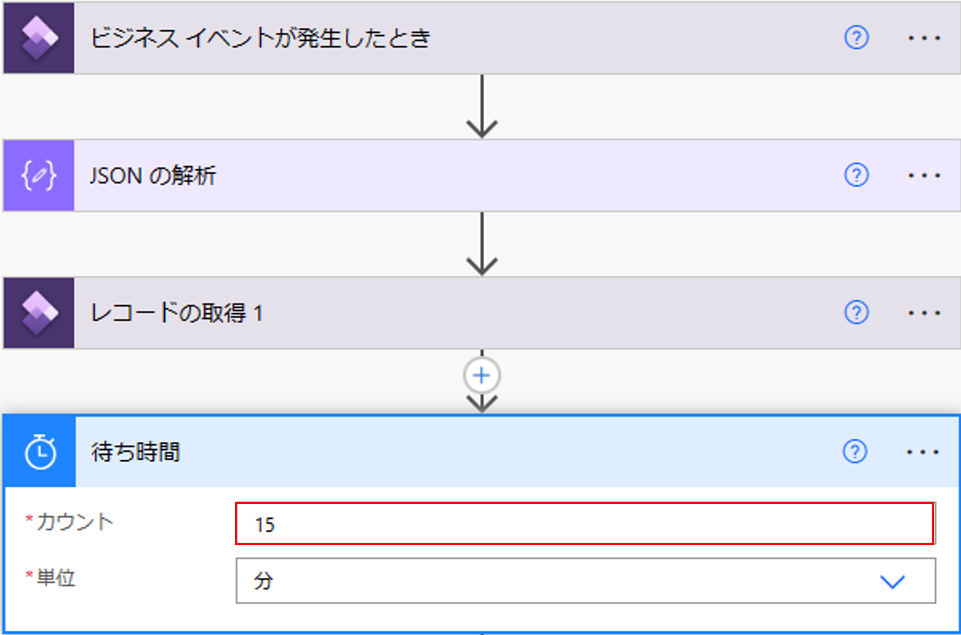
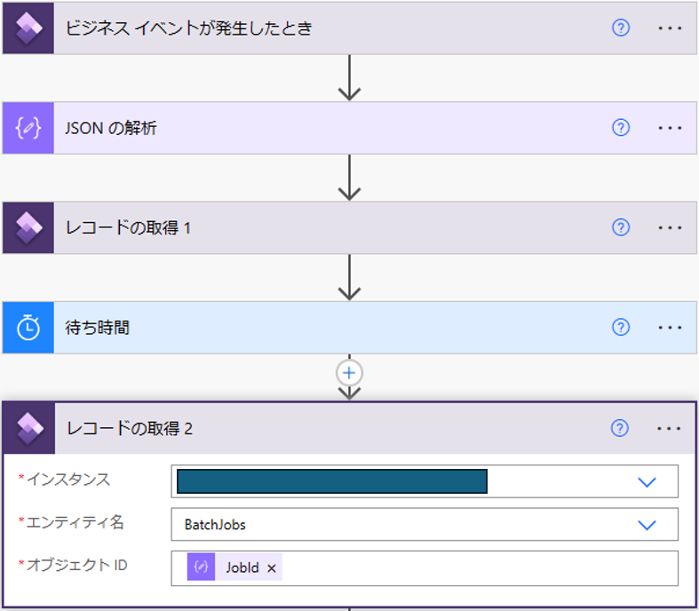
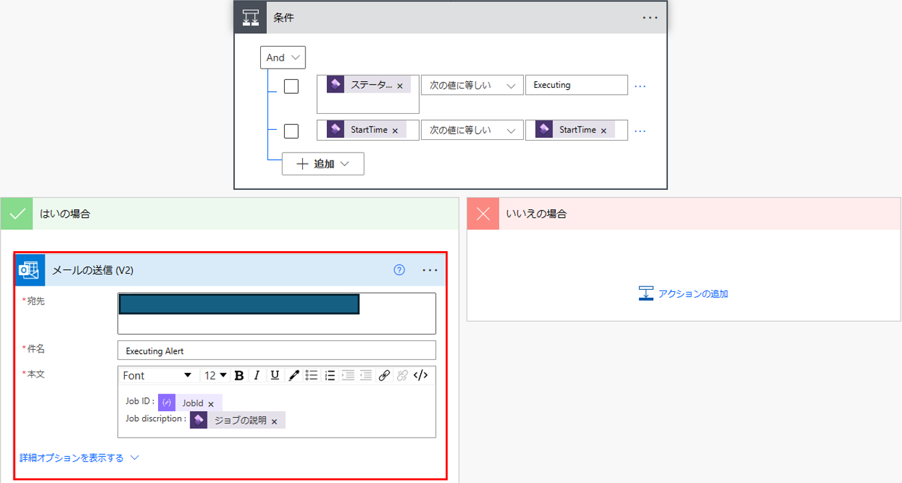

こんにちは、日本マイクロソフトの佐藤です。
この記事では、Dynamics 365 for Finance and Operations (D365FO) の Business Event の機能を用いて、Power Automate で Executing のままになっているバッチ　ジョブを検知する方法をご案内します。

バッチ ジョブの通常の処理時間が分かっている場合、この手順により、通常よりも長い時間 Executing のままになっているバッチ ジョブを検知することができます。  

<!-- more -->
## 検証に用いた製品・バージョン
Dynamics 365 Finance and Operations
Application version: 10.0.33
Platform version: PU57

## D365FO のバッチ ジョブにおける Business Event の有効化
下記の操作で、 D365FO のバッチ ジョブにおける Business Event を有効化します。

[システム管理] > [照会] > [バッチ ジョブ] から、対象のバッチ ジョブに関しまして、Business Event を有効化します。

[Business Event] タブから [開始済] を ”はい” に設定し、[OK] を選択します。


この設定により、対象のバッチ ジョブが開始した際に Business Event が発生します。

## Power Automate のフロー作成
[Power Automate](https://make.powerautomate.com/) からフローを作成します。サインインの際は、 FO 環境に登録されているユーザーを使用します。今回は例として、"Executing" のままのバッチ ジョブがあった場合、任意のユーザーにメールを送信するフローを作成します。

最終的なフローの形は以下になります。


1. 右上に表示されている環境は、お客様の FO の環境が [PowerPlatform統合](https://learn.microsoft.com/ja-jp/dynamics365/fin-ops-core/dev-itpro/power-platform/enable-power-platform-integration) が設定されている環境を指定します。

2. [作成] > [自動化したクラウド フロー] を選択します。その後、任意のフロー名を設定し、検索に "Fin" と入力して [ビジネス イベントが発生したとき] のトリガーを選択します。[作成] を選択します。


3. フローの作成画面が開きます。 [ビジネス イベントが発生したとき] のトリガーにて、インスタンスに対象の環境、カテゴリに "Batch"、ビジネス イベントに "Batch job started" を選択します。
※ FO 環境の言語設定が日本語の場合、設定が正しく読み取られませんので、英語に設定して、当フローは作成してください。


4. [新しいステップ] から [JSONの解析] アクションを選択します。コンテンツに [ビジネス イベントが発生したとき] の body を選択します。スキーマを [サンプルから作成] します。


サンプルのJSONを入力し、完了を選択します。このアクションにより、トリガーで取得した出力を、動的に後のフローで使用することができます。
```javascript
{"AdminEmailId":"","BusinessEventId":"","BusinessEventLegalEntity":"","ContextRecordSubject":"","ControlNumber":0,"EventId":"","EventTime":"/Date(-2208988800000)/","EventTimeIso8601":"1900-01-01T00:00:00Z","InitiatingUserAADObjectId":"{00000000-0000-0000-0000-000000000000}","JobDescription":"","JobEndUtcDateTime":"/Date(-2208988800000)/","JobExecutedByEmailId":"","JobId":0,"JobOwnerEmailId":"","JobStatus":"","MajorVersion":0,"MinorVersion":0,"ParentContextRecordSubjects":null}
```


上記のサンプルに関しましては、FO の [システム管理] > [設定] > [ビジネス イベント] > [ビジネス イベント カタログ] 画面から、[バッチ ジョブの開始] イベントの [スキーマのダウンロード] を選択すると、ダウンロードできます。


5. [新しいステップ] から [レコードの取得] アクションを選択します (アクション名は [レコードの取得 1] とします) 。インスタンスに対象の環境、エンティティ名に"BatchJobs"、オブジェクト名に [JSONの解析] アクションの出力の [JobId] を選択します。このアクションにより、開始直後のバッチ ジョブのステータスを確認できます。


6. [新しいステップ] から [待ち時間] アクションを選択します。カウントと単位を設定できますので、通常の処理時間が分かっている場合、処理が完了しているはずの時間を入力します。このアクションにより、次のアクションを開始するまで、待機することができます。


7. [新しいステップ] から [レコードの取得] アクションを選択します (アクション名は [レコードの取得 2] とします) 。インスタンスに対象の環境、エンティティ名に"BatchJobs"、オブジェクト名に [JSONの解析] アクションの出力の [JobId] を選択します。このアクションにより、待ち時間後のバッチ ジョブのステータスを確認できます。


8.  [新しいステップ] から [条件] コントロールを選択します。[追加] > [行の追加] からANDの条件式を2つ設定します。

１つ目の条件式は、値の選択に [レコードの取得 2] アクションの出力の [ステータス] を選択し、条件に [次の値に等しい]、値に "Executing" を設定します。このコントロールにより、待ち時間後も "Executing" のままのバッチジョブを検知することができます。

2つ目の条件式は、値の選択に [レコードの取得 1] アクションの出力の [Start Time] を選択し、条件に [次の値に等しい]、値に [レコードの取得 2] アクションの出力の [Start Time] を設定します。このコントロールにより、待ち時間前と [Start Time] が同じバッチジョブを検知することができます。


9. "はいの場合" の [アクションの追加] から [メールの送信(V2)] アクションを選択します。宛先に任意のユーザー、件名と本文に任意の文章を入力します。また、その際に動的な値として、今までのフローの出力を設定することができます。このアクションにより、"Executing" のままのバッチ ジョブがあった場合、任意のユーザーにメールを送信し、バッチジョブの内容を通知できます。


ビジネス イベントの詳細に関しましては、下記の公開資料に情報がございますので、参照ください。

[Microsoft Power Automate 内のビジネス イベント](https://learn.microsoft.com/ja-jp/dynamics365/fin-ops-core/dev-itpro/business-events/business-events-flow)

---
## おわりに  
以上、D365FO の Business Event の機能を用いて、Power Automate で Executing のままになっているバッチジョブを検知する方法をご紹介させていただきました。
