こんにちは、Dynamics ERP サポートチームの細野です。
この記事では、Dynamics 365 Finance and Operationsにて、ダウンタイムなしでカスタム X++ スクリプトを実行する方法を紹介します。

<!-- more -->
## 検証に用いた製品・バージョン
Dynamics 365 Finance and Operations      
Application version: 10.0.33
Platform version: PU57

## 手順
1. クラウドホスト環境、開発環境等にて Visual Studio を開く
1. [Dynamics 365] > [Model Management] > [Create model] を開く
    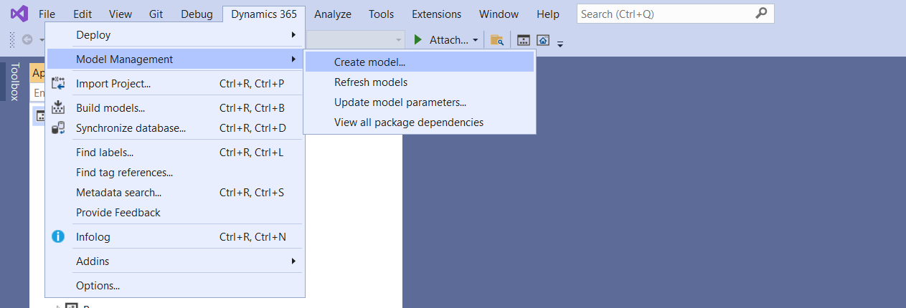
1.  "Model name" "Model publisher" "Model descripstion" を入力し [Next] をクリックする
    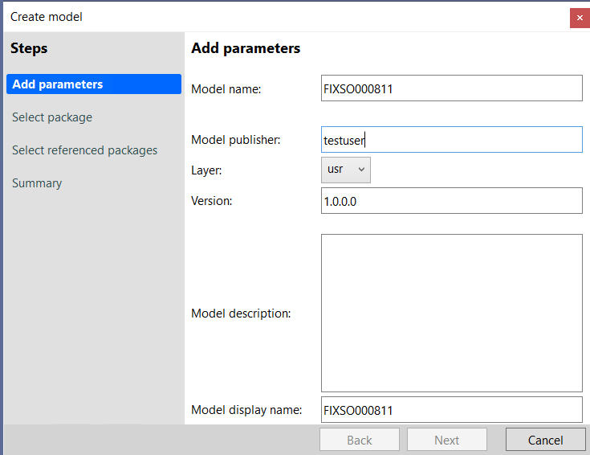
1.  [Create new package] を選択し [Next] をクリックする
    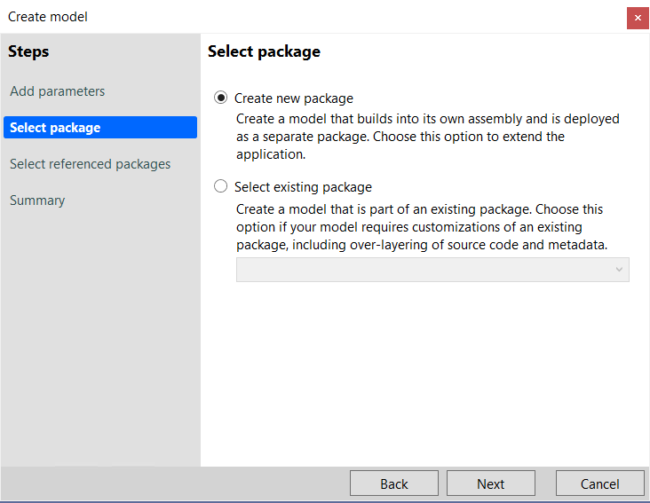
1. "ApplicationPlatform" "ApplicationSuite" "SourceDocumentationTypes" の 3 つを選択し [Next] をクリックする
    ※ スクリプトの内容により選択するモデルが異なる場合がございます。
    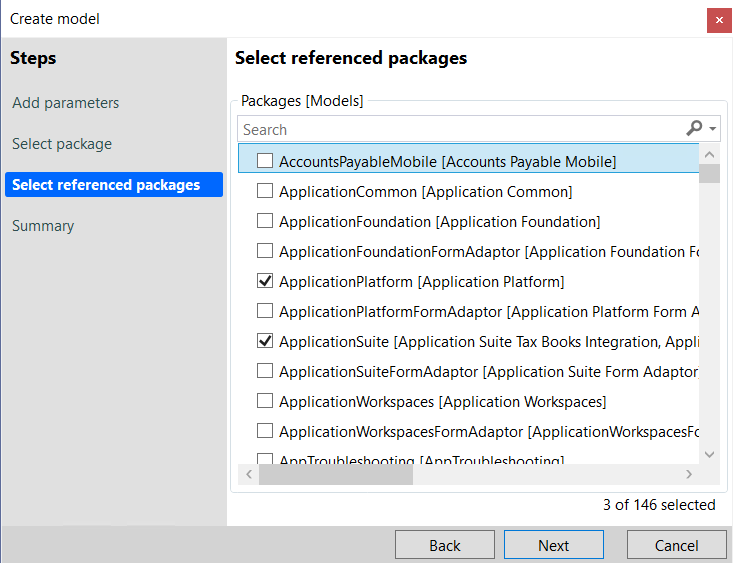
    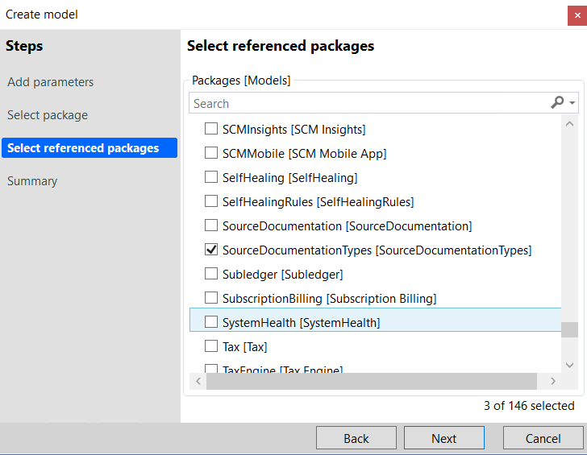

1. 入力および選択した内容を確認し [Next] をクリックする
    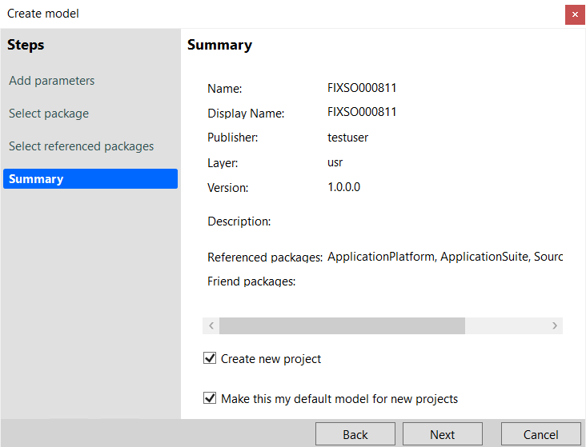
1. "Project name" にて名前を入力し [Create] を選択する
    
1. Project の作成完了後、[Solution Explorer] にて右クリック [Add] > [New Item] を選択し "Add New Item" のダイアログを開く
    
1. [FinanceOperations] > [Dynamics 365 Items] を開き、[Code] を選択、[Runnable Class(Job)] を選択する
    
1. 作成された Class に修正スクリプトを記載する
    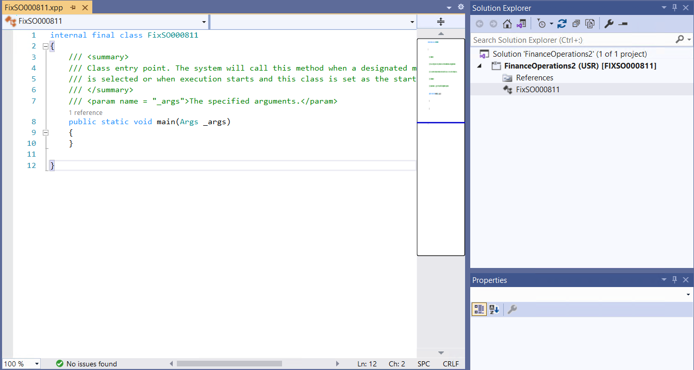
例. 
    ``` C#
    class FixSO000811
    {
        public static void main(Args _args)
         {
            ttsbegin;

            InventTrans inventTrans;

            select forupdate inventTrans
                where inventTrans.RecId == 68719841375;

            inventTrans.Qty = -10;
            inventTrans.Update();

            ttscommit;

            Info('Script completed successfully');
        }
    }
    ```
    
    
11.	[Dynamics 365] > [Deploy] > [Create Deployment Package] を開く
    
12.	対象の Class を選択、保存先のロケーションを入力し [Create] を選択する
    
    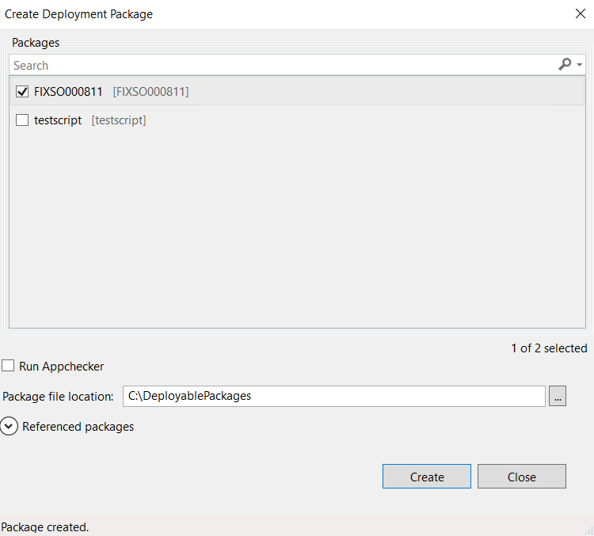
    
13.	Dynamics 365 Finance and Operations を開き、[システム管理] > [定期処理] > [データベース] > [カスタム スクリプト] に移動する
    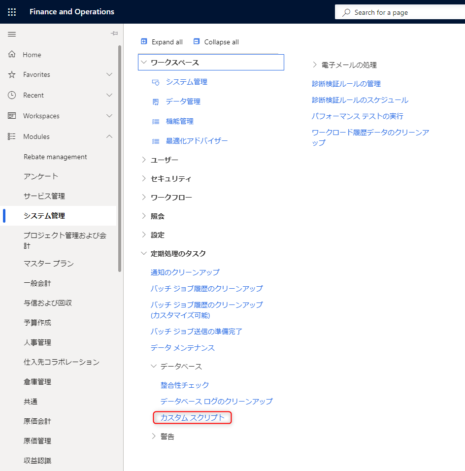
14.	[カスタム スクリプト] にてアップロードを選択し、作成したパッケージをアップロードする
    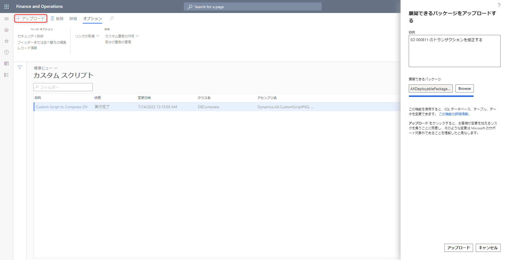
    
15.	スクリプトの承認のため、別ユーザーで同環境にログインする
    ※ スクリプトを誤って実行することがないように、アップロードを実行したユーザーでは承認できないように制御されています。必ずほかのユーザーで承認を実行する必要があります。
16.	レコードを選択し、詳細画面を開き [承認] をクリックする
    
    
    
17.	[テストの実行] を選択する
    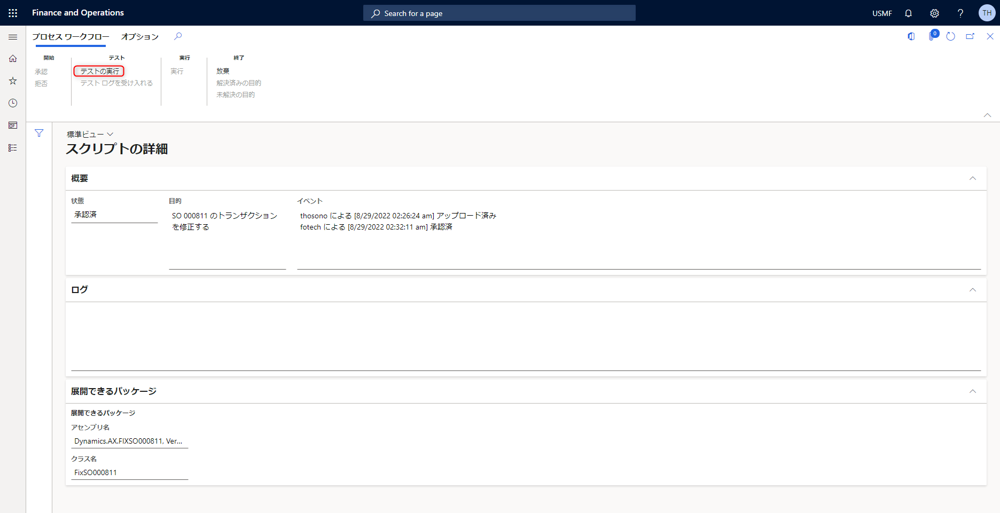
18. ログの内容を確認し、問題なければ [テスト ログを受け入れる] を選択する
    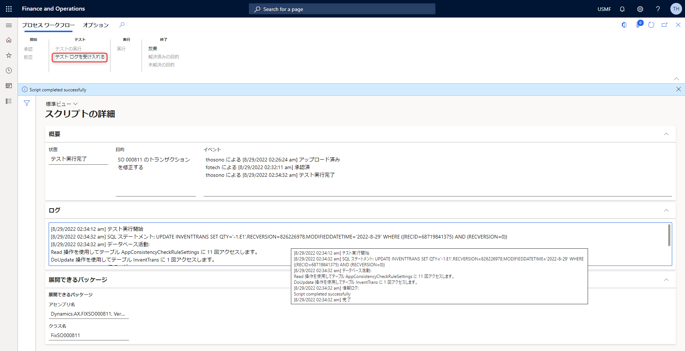
    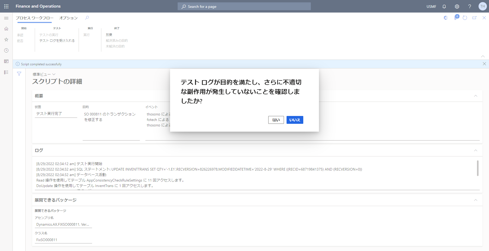
19. [実行] を選択する
    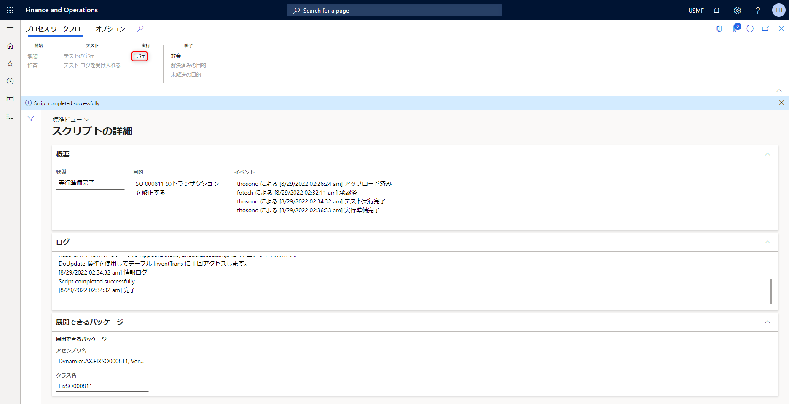
    
20. 実行後のログを確認する
    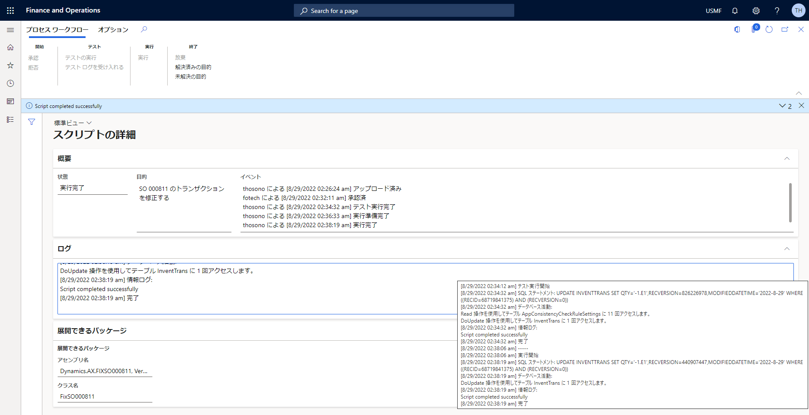
21. 対象のレコードが想定通りに修正されていることを確認する
    
22. [解決済みの目的] をクリックし、スクリプトの状態を "解決済み" に更新する
    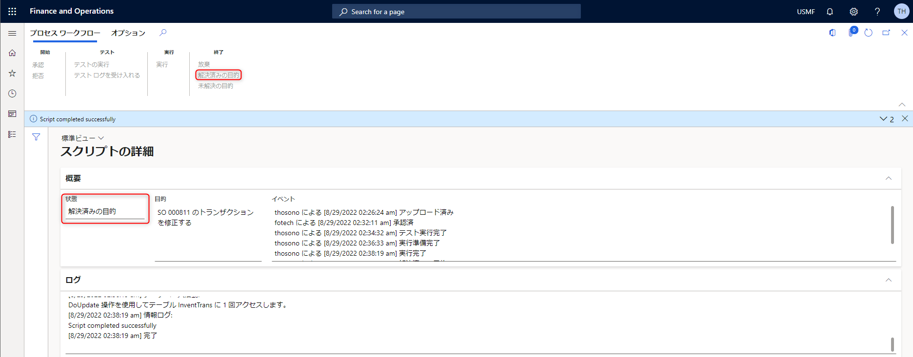

## 注意
上記の手順、手順内の画像については本記事の執筆時のものです。
実際の画面とは挙動に違いがある可能性がございます。

手順内に例示のスクリプトは、デモデータに対して実行可能なものとなりますが実行結果を保証するものではありません。実行する際には検証環境等で影響範囲を十分に検証のうえ、実施いただきますようお願いいたします。

## 参考
(関連公開資料) 
[配置可能なモデル パッケージの作成 - Finance & Operations | Dynamics 365 | Microsoft Learn](https://learn.microsoft.com/ja-jp/dynamics365/fin-ops-core/dev-itpro/deployment/create-apply-deployable-package)
[ダウンタイムなしでカスタム X++ スクリプトの実行 - Finance & Operations | Dynamics 365 | Microsoft Learn](https://learn.microsoft.com/ja-jp/dynamics365/fin-ops-core/dev-itpro/deployment/run-custom-scripts)

---
## おわりに  

以上、Dynamics 365 Finance and Operations にて、ダウンタイムなしでカスタム X++ スクリプトを実行する方法を紹介いたしました。  
